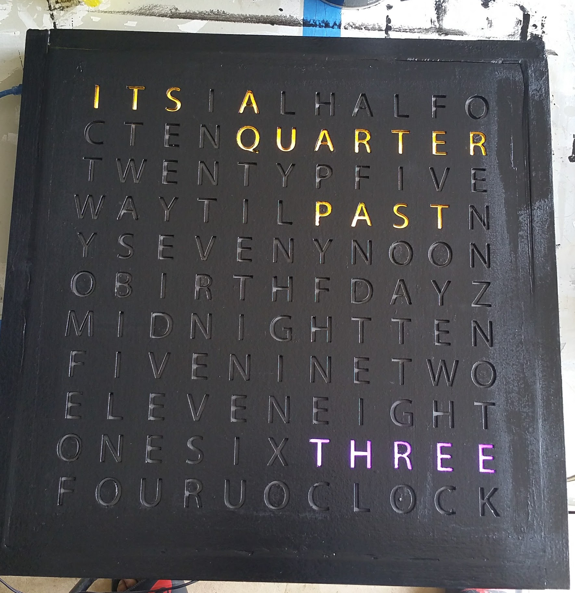
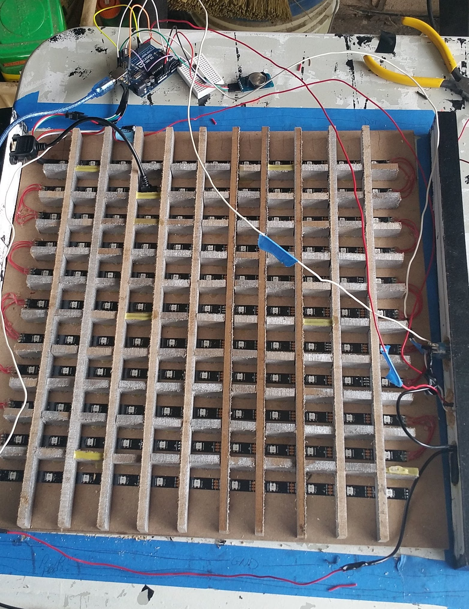
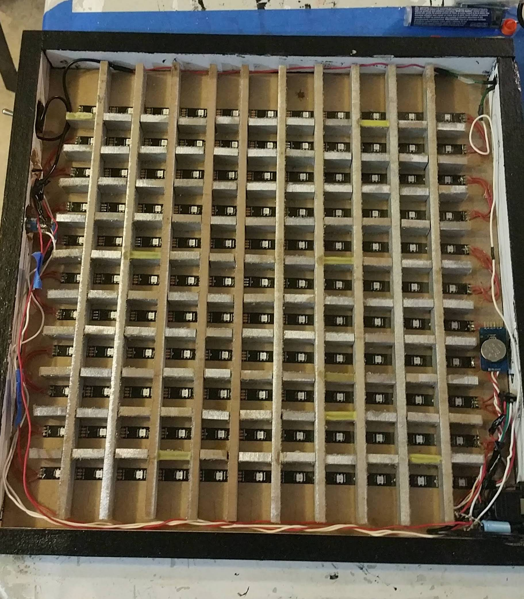

# Word Clock

## Intro

This project was a personal project I built primarily following [this Reddit tutorial](https://www.reddit.com/r/DIY/comments/4rb7uz/i_made_a_word_clock_out_of_wood_from_an_acoustic/) during the summer of 2017. From the tutorial, I thought the aesthetic of the clock was super neat, and this seemed like a fun way to challenge my code writing skills, and do some mechanical design at the same time.

## Design

### Mechanical
The layout of the face is taken from the tutorial. The top half of the face features words like _ITS_, _HALF_, _QUARTER_, _PAST_, _TIL_, etc to form the first half of a sentence like _"Its half past three"_. The bottom half of the face has all 12 possible hours of the day, from _MIDNIGHT_ to _NOON_, and _ONE_, _TWO_, _THREE_, etc.

The face was designed first in Excel to properly organize the letters into words, then ported to Adobe Illustrator, where it was fine tuned for size to be laser cut. The face is laser cut out of 1/8" balsa.

Inside the frame, there are slats made of MDF that I cut to ensure that color doesn't bleed through to neighboring letters. Ideally, these should have been routed, but I didn't have access to one so I improvised :D

The entire frame rests on a 1/4" MDF, making it all nice and heavy. Definitely a point to improve on next time.

### Electrical

Given my very basic knowledge of electrical components at the time that I was making this, the component selection was made with ease of implementation in mind. The backlights I chose were addressable Adafruit Neopixels, and an I2C-enabled RTC module for timekeeping. Two buttons (one latching and one momentary) were also included, and all peripherals were tied together with an Adafruit Pro Trinket.

### Code

The code for this system was all written in C++, following Arduino syntax & conventions. The structure follows a finite state machine, where states are primarily toggled by a push of the momentary switch. States include:
 - `WORD_MODE`:   Default mode, where words spell out the current time
 - `DIGIT_MODE`:  4 digit 24-hr time is displayed in quadrants. Letters illuminate to create the shape of a bigger digit.
 - `BIRTHDAY_MODE`: A happy birthday message :D
 - `SECRET_MODE`: I guess its not a secret if its in the README, but a fourth mode to create fun shapes with the letters. Configurable by changing the `SECRET_MESSAGE`array. Currently set to a pulsing heart to create a romantic mood for that special someone ;)
